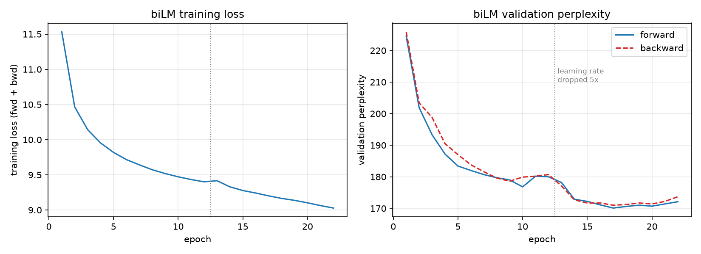
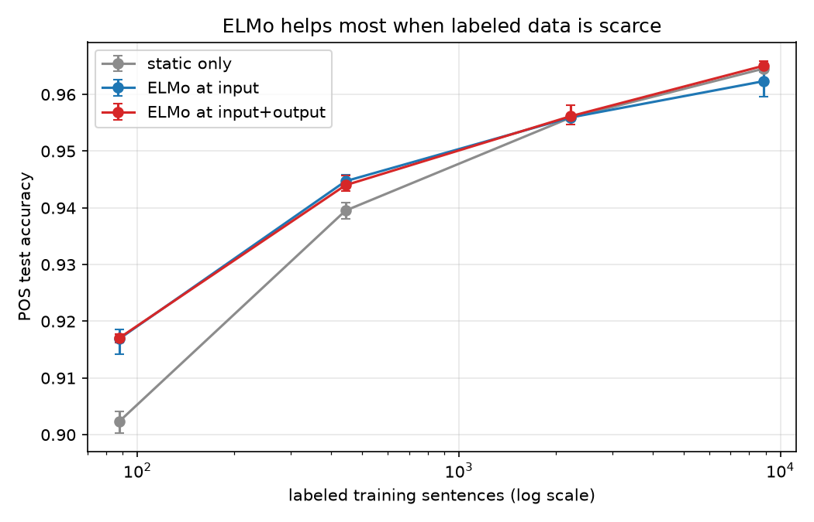
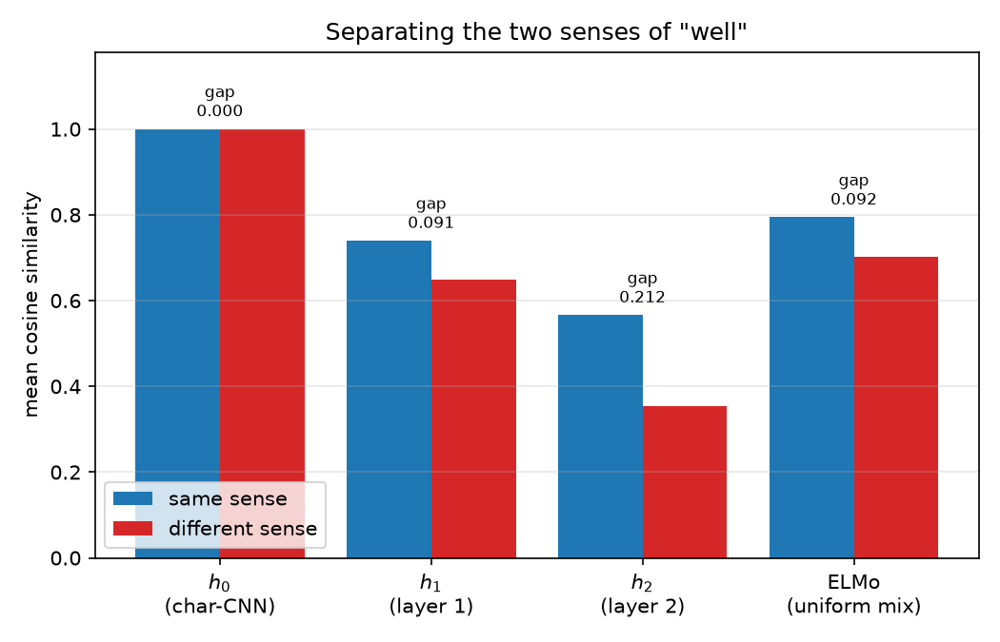
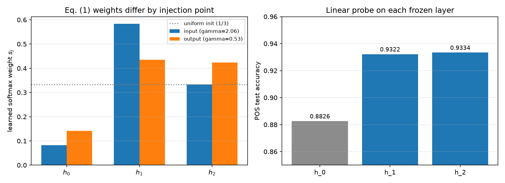

# Small-Scale ELMo

A toy replication of **ELMo** ([Peters et al., 2018](https://arxiv.org/abs/1802.05365)). A character-level CNN (kernel widths 2–5, 128-dim output) builds each word's vector from its letters; two 128-unit LSTM layers then read every sentence forward and backward as two independent stacks, sharing the char-CNN and softmax weights but keeping direction-specific recurrent weights, with a residual connection from layer 1 into layer 2. It trains as a bidirectional language model on ~290k words of Project Gutenberg text, and is then frozen and used as a feature extractor, where a learned scalar mix (Eq. 1) collapses its three layers into a single vector per token.

## Results

**biLM training** — forward and backward perplexity stay balanced; the step down is a 5× learning-rate drop.



**Low-resource POS tagging** — ELMo's advantage is largest with few labels and vanishes once the baseline has enough supervision (3 seeds, min/max bars).



**Word-sense separation** — the char-CNN layer gives *identical* vectors for both senses of "well"; LSTM layer 2 separates them.



**Learned layer weights and layer probes** — the input and output injection points learn different mixes, and both LSTM layers beat the char-CNN.



**In short:** contextual representations beat static ones by 5 points on part-of-speech probing and cleanly disambiguate word senses that a static embedding cannot distinguish at all, with the gain largest when labeled training data is scarce.

## Run

```bash
pip install -r requirements.txt
python train.py 12      # pretrain the biLM
python elmo.py          # sense-separation comparison
python downstream.py    # POS tagging, static vs +ELMo
python sweep.py         # low-resource sweep
python plots.py         # regenerate figures
```
